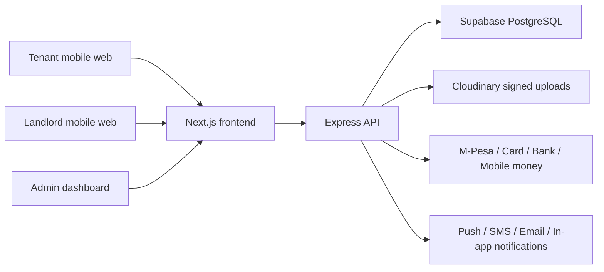

# MASQANI Architecture

## High-Level Flow

## Frontend

- `apps/web` uses Next.js App Router, React, Tailwind CSS, and Framer Motion.
- UI is Android-first: touch targets are large, mobile bottom navigation is always available on tenant/landlord/admin surfaces, and dense dashboard views collapse into scannable cards.
- `src/context` stores app-wide UI state such as dark mode and saved property IDs.
- `src/hooks` contains reusable client hooks.
- `src/services` isolates API calls from components.

## Backend

- `apps/api` uses Express with controllers, services, routes, and middleware.
- JWT authentication supports tenant, landlord, and admin roles.
- OTP phone verification is mandatory before landlord subscription checkout and publishing.
- `subscriptionGate` blocks property creation when the landlord has no active subscription, has an expired subscription, or has exceeded the plan listing limit.
- Payment services keep provider-specific code behind one interface.
- Cloudinary uploads use short-lived signatures rather than exposing API secrets to the browser.

## Database

- `packages/database/schema.sql` is PostgreSQL-first and Supabase-ready.
- Core tables: `users`, `properties`, `property_media`, `subscriptions`, `payments`, `messages`, `notifications`, `reviews`, `viewing_requests`, `applications`, `saved_properties`, `reports`, and `plans`.
- Subscription status is updated with database functions and API checks.

## Security Model

- Helmet, CORS allowlists, rate limiting, role-based access control, input validation, OTP verification, CSRF protection for cookie-authenticated writes, signed Cloudinary uploads, and provider webhook signature verification.
- Production deployment must terminate HTTPS at Vercel/API host and set secure cookies.
